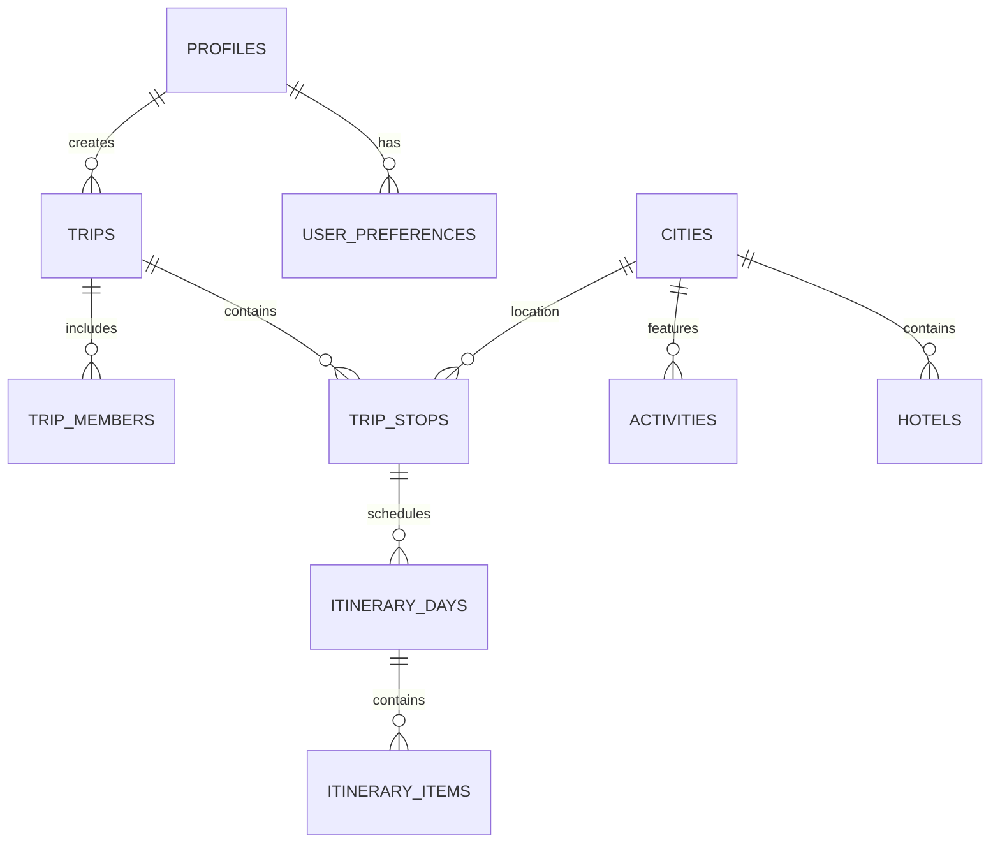
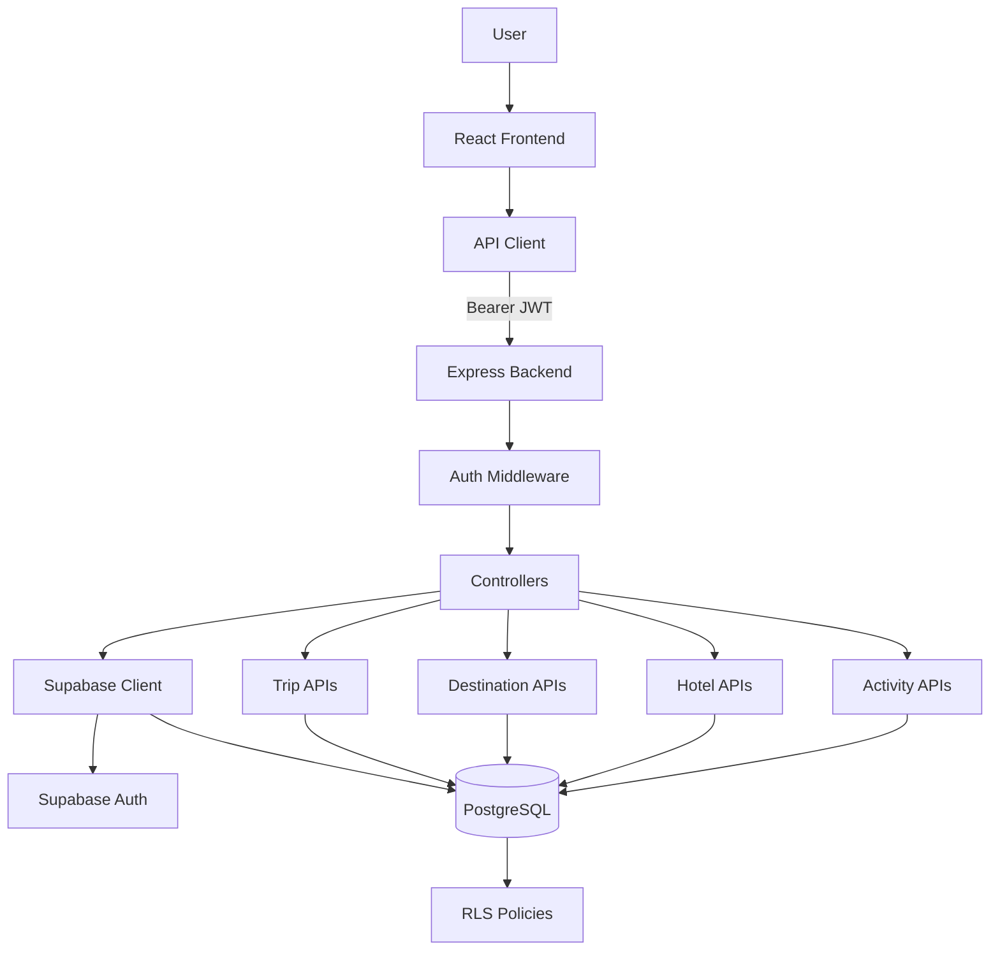

# 🌍 GlobeTrotter

GlobeTrotter is an intelligent, full-stack travel planning platform designed to modernize the way users discover destinations, build itineraries, and manage travel budgets. By integrating rich reference data with dynamic planning capabilities, GlobeTrotter shifts travel planning from fragmented spreadsheets to a unified, visually stunning experience.

Our long-term vision is to evolve GlobeTrotter into an **AI-powered Travel Agent** that can autonomously plan, validate constraints, and dynamically replan itineraries on the fly. 

Currently, the application provides a robust foundation: a React frontend, an Express backend, and a secure Supabase PostgreSQL database handling authentication, Row Level Security (RLS), and comprehensive CRUD operations for multi-city trips.

---

## Table of Contents

- [1. Project Overview](#1-project-overview)
- [2. Problem Statement](#2-problem-statement)
- [3. Solution](#3-solution)
- [4. Current Feature Status](#4-current-feature-status)
- [5. Development Roadmap](#5-development-roadmap)
- [6. System Architecture](#6-system-architecture)
- [7. Detailed Request Flow](#7-detailed-request-flow)
- [8. Authentication Architecture](#8-authentication-architecture)
- [9. Database Architecture](#9-database-architecture)
- [10. Backend Architecture](#10-backend-architecture)
- [11. API Documentation](#11-api-documentation)
- [12. Frontend Architecture](#12-frontend-architecture)
- [13. Trip Management Flow](#13-trip-management-flow)
- [14. Itinerary Architecture](#14-itinerary-architecture)
- [15. Budget Engine](#15-budget-engine)
- [16. AI Travel Agent Architecture](#16-ai-travel-agent-architecture)
- [17. AI Agent Loop](#17-ai-agent-loop)
- [18. AI Agent Tools](#18-ai-agent-tools)
- [19. AI Planning + Replanning](#19-ai-planning--replanning)
- [20. AI Trip Assistant](#20-ai-trip-assistant)
- [21. Map / Calendar / Timeline Architecture](#21-map--calendar--timeline-architecture)
- [22. Trip Sharing](#22-trip-sharing)
- [23. User Preferences & Memory](#23-user-preferences--memory)
- [24. Security Architecture](#24-security-architecture)
- [25. Testing Strategy](#25-testing-strategy)
- [26. AI Agent Evaluation Strategy](#26-ai-agent-evaluation-strategy)
- [27. Deterministic vs Probabilistic Architecture](#27-deterministic-vs-probabilistic-architecture)
- [28. Complete End-to-End Workflow](#28-complete-end-to-end-workflow)
- [29. Repository Structure](#29-repository-structure)
- [30. Environment Variables](#30-environment-variables)
- [31. Installation](#31-installation)
- [32. Running the Project](#32-running-the-project)
- [33. Git Workflow](#33-git-workflow)
- [34. API + Database + Frontend Integration Diagram](#34-api--database--frontend-integration-diagram)
- [35. Future Complete Architecture](#35-future-complete-architecture)
- [36. Performance & Scalability](#36-performance--scalability)
- [37. Production Readiness Checklist](#37-production-readiness-checklist)
- [38. Current Limitations](#38-current-limitations)
- [39. Future Roadmap](#39-future-roadmap)
- [40. Contribution Guidelines](#40-contribution-guidelines)
- [41. License](#41-license)

---

## 1. Project Overview

GlobeTrotter is a modern web application for travel planning. 
- **Target Users:** Independent travelers, families, and digital nomads who plan multi-city itineraries.
- **Core Value Proposition:** A single platform to discover places, build a day-by-day itinerary, and eventually rely on AI to handle scheduling constraints, budget tracking, and real-time replanning.
- **Current Implementation Status:** Phase 4 is complete. We have a working authenticated full-stack application with real API routes, real database persistence, and a highly polished UI for trip creation and destination discovery.
- **Long-term Vision:** To build an autonomous AI travel agent capable of robust deterministic validation and probabilistic itinerary generation.

## 2. Problem Statement

Traditional travel planning is broken and fragmented:
- Users bounce between 10+ tabs (flights, hotels, blogs, maps).
- Manual itinerary creation in spreadsheets is tedious and prone to scheduling errors.
- Difficult to coordinate multi-city destinations and track a unified budget.
- Lack of personalized travel assistance—static blogs don't adapt to dynamic constraints (e.g., "I only have 3 days and $500").
- Changing plans mid-trip forces users to recalculate everything manually.

## 3. Solution

GlobeTrotter addresses these problems by centralizing travel data and planning logic.

### Current Solution
A centralized dashboard where users can seamlessly discover cities, explore hotels and activities, and construct multi-city trips. The frontend connects to a real Express backend and PostgreSQL database, securely persisting data via Row Level Security (RLS).

### Future AI-Powered Solution
An AI Travel Agent that takes user constraints and autonomously generates a validated itinerary. The agent will have access to deterministic tools (budget calculators, map APIs) to ensure the plan is practically feasible, and can replan instantly if constraints change.

## 4. Current Feature Status

| Feature          | Status         | Details                                                                 |
| ---------------- | -------------- | ----------------------------------------------------------------------- |
| Authentication   | ✅ Implemented | Supabase Auth (Sign up / Log in) + JWT Middleware                       |
| Trip Management  | ✅ Implemented | Full CRUD via `/api/v1/trips` and PostgreSQL                            |
| Cities           | ✅ Implemented | Discovery UI + `/api/v1/cities` endpoint                                |
| Activities       | ✅ Implemented | Discovery UI + `/api/v1/activities` endpoint                            |
| Hotels           | ✅ Implemented | Discovery UI + `/api/v1/hotels` endpoint                                |
| Itinerary Engine | 🟡 Partial     | UI is built, DB schema exists, but day-by-day scheduling logic is WIP   |
| Budget Engine    | 🔵 Planned     | Schema supports budgets, calculation engine planned                     |
| AI Travel Agent  | 🔵 Planned     | Architecture defined, implementation pending                            |
| Maps / Calendar  | ❌ Not Started | Planned for Phase 14                                                    |

## 5. Development Roadmap

| Phase | Description | Status | Details |
|---|---|---|---|
| PHASE 0 | Architecture & Requirements | ✅ Complete | Blueprints and system docs created. |
| PHASE 1 | Supabase Database Design | ✅ Complete | Tables, enums, RLS policies deployed. |
| PHASE 2 | Backend Foundation | ✅ Complete | Express, Vite, TS configured. |
| PHASE 3 | Authentication & Authorization | ✅ Complete | Supabase Auth & JWT Middleware active. |
| PHASE 4 | Core Trip Management | ✅ Complete | Frontend and Backend fully integrated. |
| PHASE 5 | Cities & Destinations | ✅ Complete | Reference data available via API. |
| PHASE 6 | Activities | ✅ Complete | Activities integrated into UI. |
| PHASE 7 | Hotels & Travel Data | ✅ Complete | Hotel discovery integrated into UI. |
| PHASE 8 | Itinerary Engine | 🟡 Partial | UI built, core engine logic remains. |
| PHASE 9 | Budget & Cost Engine | 🔵 Planned | - |
| PHASE 10 | AI Travel Agent Core | 🔵 Planned | - |
| PHASE 11 | Agent Tools | 🔵 Planned | - |
| PHASE 12 | Agent Planning + Replanning | 🔵 Planned | - |
| PHASE 13 | AI Trip Assistant | 🔵 Planned | - |
| PHASE 14 | Calendar / Timeline / Map APIs | 🔵 Planned | - |
| PHASE 15 | Trip Sharing & Copy Trip | 🔵 Planned | - |
| PHASE 16 | User Preferences & Memory | 🔵 Planned | - |
| PHASE 17 | Admin & Analytics | 🔵 Planned | - |
| PHASE 18 | Testing & Agent Evals | 🔵 Planned | - |
| PHASE 19 | Security & Production Hardening | 🔵 Planned | - |
| PHASE 20 | Deployment & Final Demo | ❌ Not Started | - |

## 6. System Architecture

```text
┌─────────────────────────────┐
│        React Frontend       │
│        Vite + TypeScript    │
│    (Context + API Client)   │
└──────────────┬──────────────┘
               │
               │ HTTPS / REST API
               │ Authorization: Bearer <JWT>
               ▼
┌─────────────────────────────┐
│     Express Backend         │
│       Node.js + TS          │
│                             │
│ Routes → Controllers        │
│ Middleware → Services       │
└──────────────┬──────────────┘
               │
               │ Authenticated Supabase Client
               │ (Enforces User Claims)
               ▼
┌─────────────────────────────┐
│        Supabase             │
│                             │
│ Auth + PostgreSQL + RLS     │
└─────────────────────────────┘
```

The system is a modular monolith. The frontend never accesses the database directly. It communicates strictly with the Express backend, which securely proxies queries to Supabase using the user's JWT.

## 7. Detailed Request Flow

```text
User Clicks "Create Trip"
 ↓
React Component (CreateTripPage.tsx)
 ↓
Service Layer (tripService.ts)
 ↓
API Client (apiClient.ts) -> Injects Supabase JWT
 ↓
HTTP POST /api/v1/trips
 ↓
Express Route (trip.routes.ts)
 ↓
Authentication Middleware (auth.middleware.ts) -> Validates JWT
 ↓
Controller (trip.controller.ts) -> Instantiates getAuthSupabaseClient(req.token)
 ↓
Supabase API
 ↓
PostgreSQL Database
 ↓
RLS Policy (Ensures user_id matches token.sub)
 ↓
Response (JSON)
 ↓
Frontend State (TripContext.tsx)
 ↓
UI Update
```

## 8. Authentication Architecture

GlobeTrotter utilizes **Supabase Auth** for identity management.

1. **Signup/Login:** Frontend securely calls `supabase.auth.signInWithPassword()`.
2. **Session Handling:** `AuthContext.tsx` listens to `onAuthStateChange`.
3. **API Requests:** `apiClient.ts` retrieves the current `session.access_token` and attaches it to the `Authorization: Bearer <token>` header.
4. **Backend Validation:** `requireAuth` middleware verifies the JWT signature.
5. **Database Security:** The controller initializes a Supabase client with the user's JWT, ensuring all PostgreSQL queries are filtered by **Row Level Security (RLS)**.

```text
User
 ↓
Supabase Auth (Frontend)
 ↓
JWT Access Token
 ↓
Authorization Header (Bearer)
 ↓
Express Middleware (requireAuth)
 ↓
Authenticated Supabase Client
 ↓
PostgreSQL RLS Policies
```

## 9. Database Architecture

Our PostgreSQL database hosted on Supabase uses the following schema:



Key aspects:
- **`profiles`**: Tied to `auth.users` via triggers.
- **`trips`**: Core aggregate root.
- **`trip_stops`**: A specific city visit within a trip.
- **`itinerary_days` & `itinerary_items`**: Granular day-by-day scheduling.
- **RLS**: Every table has RLS enforcing `auth.uid() = user_id`.

## 10. Backend Architecture

```text
backend/
├── src/
│   ├── config/      # Env & Supabase client config
│   ├── controllers/ # HTTP Request Handlers (trips, cities, hotels)
│   ├── middleware/  # Auth, Error, Validation interceptors
│   ├── routes/      # Express Router definitions
│   ├── utils/       # Logger, Error classes, Response formatters
│   ├── types/       # TypeScript types
│   ├── server.ts    # Server initialization
│   └── app.ts       # Express app configuration
├── tests/           # Vitest test suites
├── package.json
└── tsconfig.json
```

The backend is built with Express and TypeScript. It uses a standard MVC-style Controller-Router architecture.

## 11. API Documentation

| Method | Endpoint | Authentication | Purpose |
|---|---|---|---|
| GET | `/api/v1/health` | Public | System health check |
| GET | `/api/v1/cities` | Required | Fetch featured cities / filter by region |
| GET | `/api/v1/hotels` | Required | Fetch hotels (query `city_id`) |
| GET | `/api/v1/activities` | Required | Fetch activities (query `city_id`) |
| GET | `/api/v1/trips` | Required | Fetch user trips |
| POST | `/api/v1/trips` | Required | Create a new trip |
| GET | `/api/v1/trips/:id` | Required | Get trip details (incl. stops & itinerary) |
| PATCH | `/api/v1/trips/:id` | Required | Update a trip |
| DELETE | `/api/v1/trips/:id`| Required | Delete a trip |

## 12. Frontend Architecture

The frontend is a **React + Vite + TypeScript** Single Page Application (SPA).
- **Styling:** Tailwind CSS + custom UI components (`/src/components/ui`).
- **State:** React Context API (`AuthContext`, `TripContext`).
- **Routing:** React Router v7 (`AppRoutes.tsx`).
- **Services:** Singleton service classes (`tripService`, `cityService`) orchestrate data fetching using `apiClient.ts`.
- **Pages:** Split into logical domains (`/auth`, `/dashboard`, `/trips`, `/profile`).

## 13. Trip Management Flow

```text
Dashboard
    ↓
Click "Create Trip"
    ↓
CreateTripPage (Form)
    ↓
tripService.createTrip(dto)
    ↓
apiClient POST /api/v1/trips
    ↓
TripController (Express)
    ↓
Supabase Database (INSERT INTO trips)
    ↓
Return New Trip Object
    ↓
Frontend redirects to /trips/:id/cities
```

## 14. Itinerary Architecture

### Current
The frontend provides a rich UI for creating trips, adding city stops, and exploring hotels/activities. The database schema supports `trip_stops`, `itinerary_days`, and `itinerary_items`.

### Future (Planned)
The Itinerary Engine will be responsible for:
- Day-by-day scheduling of activities.
- Validating travel time between locations.
- Ensuring activities fit within operating hours.
- Automatic rescheduling if a user modifies their trip length.

## 15. Budget Engine

**Future Architecture — Planned**

```text
Trip Aggregate
 ↓
Transportation Costs (Flights, Trains)
 ↓
Hotel Costs (Nights × Price)
 ↓
Activity Costs
 ↓
Daily Allowance (Food, Misc)
 ↓
Total Estimated Cost
 ↓
Compare against Target Budget
```
The Budget Engine will enforce constraints deterministically, rejecting AI proposals that exceed the user's budget.

## 16. AI Travel Agent Architecture

**Future Architecture — Planned**

```text
                    USER
                     │
                     ▼
              AI TRAVEL ASSISTANT
                     │
                     ▼
              AGENT ORCHESTRATOR
                     │
          ┌──────────┼──────────┐
          ▼          ▼          ▼
       PLANNER     MEMORY      STATE
          │
          ▼
       TOOL ROUTER
          │
    ┌─────┼─────────┐
    ▼     ▼         ▼
  Cities Hotels Activities
    │     │         │
    └─────┼─────────┘
          ▼
      Trip Database
          │
          ▼
     CONSTRAINT CHECK (Deterministic)
          │
          ▼
      PLAN / REPLAN
          │
          ▼
     FINAL ITINERARY
```

## 17. AI Agent Loop

**Future Architecture — Planned**

```text
User Request
     ↓
Understand Intent
     ↓
Load Trip Context & Memory
     ↓
Analyze Constraints (Budget, Dates)
     ↓
Create Plan
     ↓
Select Tool
     ↓
Execute Tool (Deterministic API Call)
     ↓
Observe Result
     ↓
Validate Constraints
     ↓
Need More Information?
    ↙        ↘
   YES       NO
    ↓         ↓
Select      Finalize
Next Tool     Plan
    ↓
Replan if needed
```

## 18. AI Agent Tools

**Planned Tools:**
- `search_cities(region, vibe)`
- `search_hotels(city_id, max_price)`
- `search_activities(city_id, category)`
- `add_itinerary_item(trip_id, day, activity_id)`
- `calculate_budget(trip_id)`
- `optimize_route(itinerary_items)`

## 19. AI Planning + Replanning

**Future Architecture — Planned**

```text
User Constraints (E.g. "$1000 budget, 5 days")
      ↓
Candidate Itinerary Generation (Probabilistic LLM)
      ↓
Constraint Validator (Deterministic Code)
      ↓
Valid?
  │       │
 NO      YES
  │       │
Replan   Finalize
  │
  └──────► (Agent tries a cheaper hotel tool)
```

Replanning triggers: Budget exceeded, schedule overlap, activity unavailable.

## 20. AI Trip Assistant

**Future Architecture — Planned**
A conversational sidecar UI.
User: "Move the museum tour to Day 3 and find a cheaper hotel."
The Assistant will invoke the `remove_item`, `add_item`, and `search_hotels` tools to securely modify the PostgreSQL state, rather than just returning text.

## 21. Map / Calendar / Timeline Architecture

**Future Architecture — Planned**
- **Map:** Integrate Mapbox/Google Maps to plot `trip_stops` coordinates.
- **Timeline:** Visual Gantt-chart style timeline for daily activities.
- **Calendar:** Export itineraries to iCal/Google Calendar.

## 22. Trip Sharing

**Future Architecture — Planned**
- **Sharing:** Generate a UUID-based public URL (e.g., `/shared/trip-123`).
- **Copy Trip:** Allow authenticated users to clone a public trip into their own account, duplicating records but re-assigning the `user_id`.

## 23. User Preferences & Memory

**Future Architecture — Planned**
- Users will define default currencies, dietary restrictions, and preferred travel styles (e.g., Luxury vs Backpacking).
- The AI Agent will inject this memory into the system prompt to personalize results.

## 24. Security Architecture

- **Supabase Auth:** Secure identity management.
- **JWT Verification:** Express middleware (`auth.middleware.ts`) strictly verifies signatures.
- **Row Level Security (RLS):** Policies guarantee users can only SELECT, UPDATE, or DELETE their own data.
- **Secrets Management:** `.env` files are `.gitignore`d. API keys are kept strictly out of the repository.
- **Future:** API Rate limiting, Helmet (implemented), CORS (implemented).

## 25. Testing Strategy

### Current
- Backend unit tests for health and validation (`vitest`).
- Manual E2E Browser Testing.

### Future
- Frontend component tests (Vitest + React Testing Library).
- Database RLS audits.
- E2E testing using Playwright.
- AI Agent Evaluation Suite.

## 26. AI Agent Evaluation Strategy

**Future Architecture — Planned**

| Component | Deterministic / Probabilistic | Reason |
|---|---|---|
| Authentication | Deterministic | Security must be strict. |
| Budget calculation | Deterministic | Math must be accurate. |
| Permission checks | Deterministic | Data isolation. |
| Tool selection | Probabilistic | LLM reasoning. |
| Itinerary optimization | Hybrid | LLM drafts, Code validates constraints. |
| Final response | Probabilistic | Natural language generation. |

## 27. Deterministic vs Probabilistic Architecture

LLMs (Probabilistic) are prone to hallucinations. GlobeTrotter strictly isolates reasoning from validation. 

```text
                 AGENT
                   │
          ┌────────┴────────┐
          ▼                 ▼
   PROBABILISTIC       DETERMINISTIC
      LAYER                LAYER
     (LLM Logic)        (Node.js/SQL)
          │                 │
     Reasoning          Validation
     Tool Choice        Budget Math
     Language           Permissions
          │                 │
          └────────┬────────┘
                   ▼
              FINAL RESULT
```

## 28. Complete End-to-End Workflow

**Current Flow:**
1. Authentication (Signup/Login)
2. Dashboard
3. Create Trip
4. Discover & Add Cities
5. Explore Hotels & Activities

**Future Additions:**
6. Build Day-by-Day Itinerary
7. Calculate Budget
8. AI Assistance & Replanning
9. Share Trip / Export to Calendar

## 29. Repository Structure

```text
GlobeTrotter_oddo/
├── backend/
│   ├── src/
│   ├── tests/
│   ├── package.json
│   └── tsconfig.json
├── frontend/
│   ├── public/
│   ├── src/
│   │   ├── components/
│   │   ├── context/
│   │   ├── lib/
│   │   ├── pages/
│   │   ├── services/
│   │   └── types/
│   ├── package.json
│   └── vite.config.ts
├── supabase/
│   ├── migrations/
│   └── seed.sql
├── docs/
└── .gitignore
```

## 30. Environment Variables

Required `.env` variables (Do not commit secrets!):

**Frontend (`frontend/.env`):**
```env
VITE_SUPABASE_URL=your_supabase_url
VITE_SUPABASE_ANON_KEY=your_supabase_anon_key
VITE_API_BASE_URL=http://localhost:5000/api/v1
```

**Backend (`backend/.env`):**
```env
PORT=5000
NODE_ENV=development
FRONTEND_URL=http://localhost:5173
SUPABASE_URL=your_supabase_url
SUPABASE_ANON_KEY=your_supabase_anon_key
```

## 31. Installation

### Prerequisites
- Node.js (v18+)
- Hosted Supabase Project (or local CLI)

### Clone
```bash
git clone https://github.com/maitri200685/GlobeTrotter_oddo.git
cd GlobeTrotter_oddo
```

### Backend
```bash
cd backend
npm install
```

### Frontend
```bash
cd frontend
npm install
```

### Database
Ensure your Supabase project is linked and push migrations:
```bash
npx supabase link --project-ref <your-project-id>
npx supabase db push
```

## 32. Running the Project

Terminal 1 (Backend):
```bash
cd backend
npm run dev
```

Terminal 2 (Frontend):
```bash
cd frontend
npm run dev
```

Navigate to `http://localhost:5173` in your browser.

## 33. Git Workflow

```text
main (Production/Stable)
  │
develop (Integration Branch)
  │
feature/* (Feature Branches)
```
- Create `feature/*` branches off `develop`.
- Merge into `develop`.
- Push `develop` to `main` for release.

## 34. API + Database + Frontend Integration Diagram



## 35. Future Complete Architecture

```text
                         USER
                           │
                           ▼
                    REACT FRONTEND
                           │
                           ▼
                     API GATEWAY
                           │
              ┌────────────┴────────────┐
              ▼                         ▼
        CORE BACKEND              AI AGENT
              │                         │
              │                 ┌───────┴───────┐
              │                 ▼               ▼
              │             PLANNER          MEMORY
              │                 │               │
              │                 ▼               │
              │            TOOL ROUTER ◄────────┘
              │                 │
              │        ┌────────┼────────┐
              │        ▼        ▼        ▼
              │      CITY     HOTEL   ACTIVITY
              │      TOOL      TOOL     TOOL
              │        │        │        │
              └────────┴────────┴────────┘
                       │
                       ▼
                 SUPABASE DATABASE
                       │
                       ▼
                      RLS
```

## 36. Performance & Scalability

**Future Considerations:**
- **Database Indexes:** Optimize PostgreSQL for geospatial (PostGIS) and JSONB queries.
- **Caching:** Redis for frequent hotel/activity lookups.
- **AI Latency:** Use streaming responses for AI assistant UI to reduce perceived latency.
- **Rate Limiting:** Protect backend APIs from abuse.

## 37. Production Readiness Checklist

- [x] API validation (Zod)
- [x] RLS audit
- [x] Environment management
- [x] Automated tests (Backend basic)
- [ ] Rate limiting
- [ ] Logging monitoring
- [ ] Database backup strategy
- [ ] AI evaluation
- [ ] Production deployment

## 38. Current Limitations

- **Data:** Currently relies on reference data loaded via Supabase seeds, not live 3rd-party APIs (e.g. Google Places, Amadeus).
- **Maps Integration:** Map APIs are stubbed out pending Google Maps API key configuration.

## 39. Future Roadmap

```text
Current (Auth + Trips + API)
  ↓
Itinerary Engine (Phase 8) - COMPLETE
  ↓
Budget Engine (Phase 9) - COMPLETE
  ↓
AI Agent Core (Phase 10) - COMPLETE
  ↓
Agent Tools (Phase 11) - COMPLETE
  ↓
AI Planner & Constraint Engine (Phase 12) - COMPLETE
  ↓
AI Trip Assistant (Phase 13) - COMPLETE
  ↓
Maps + Calendar APIs (Phase 14) - COMPLETE
  ↓
Production Release (Phase 20)
```

## 40. Contribution Guidelines

1. Create a `feature/*` branch.
2. Make focused, descriptive commits.
3. Ensure `npm run build` and `npm run lint` pass.
4. Update relevant documentation in `/docs`.
5. Submit a Pull Request targeting `develop`.

## 41. License

License has not yet been specified.
