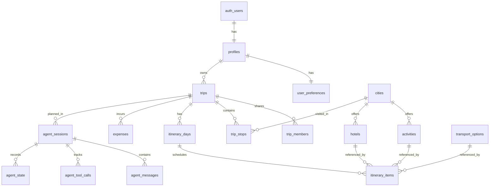

# Final Database Schema

## Entities and Relationships

**1. Profiles**
- Extends Supabase auth users automatically via a trigger.
- Fields: `id` (PK, UUID), `display_name`, `avatar_url`.

**2. User Preferences**
- Stores AI context settings.
- Fields: `user_id` (PK, UUID), `preferred_currency`, `travel_style`, `dietary_restrictions`, `accommodation_preference`.

**3. Trips**
- The core entity representing a travel plan.
- Fields: `id` (PK, UUID), `owner_id` (FK -> profiles), `title`, `start_date`, `end_date`, `total_budget`, `status`, `visibility`.
- Constraints: `end_date >= start_date`, `total_budget >= 0`.

**4. Trip Members**
- Handles sharing.
- Fields: `trip_id` (FK -> trips), `user_id` (FK -> profiles), `role` (viewer, editor, owner).

**5. Trip Stops**
- Multi-city linking.
- Fields: `trip_id` (FK -> trips), `city_id` (FK -> cities), `arrival_date`, `departure_date`, `sequence_order`.

**6. Itinerary Days**
- Groups events by specific date.
- Fields: `id` (PK), `trip_id` (FK -> trips), `day_date`.

**7. Itinerary Items**
- Individual scheduled activities.
- Fields: `itinerary_day_id` (FK -> itinerary_days), `activity_type`, `activity_id` (FK -> activities), `hotel_id` (FK -> hotels), `transport_option_id` (FK -> transport_options), `start_time`, `end_time`.

**8. Expenses**
- Budget tracking.
- Fields: `trip_id` (FK -> trips), `category`, `amount`, `is_estimated`.

**9. Reference Data (Cities, Activities, Hotels, Transport)**
- Global reference data for searches. Publicly readable.

**10. AI Agent Tables (`agent_sessions`, `agent_messages`, `agent_tool_calls`, `agent_state`)**
- Tracks the conversational state, iteration numbers, structured constraint solving state, and individual LLM tool requests. Strictly owned by `user_id`.

## ERD Overview

